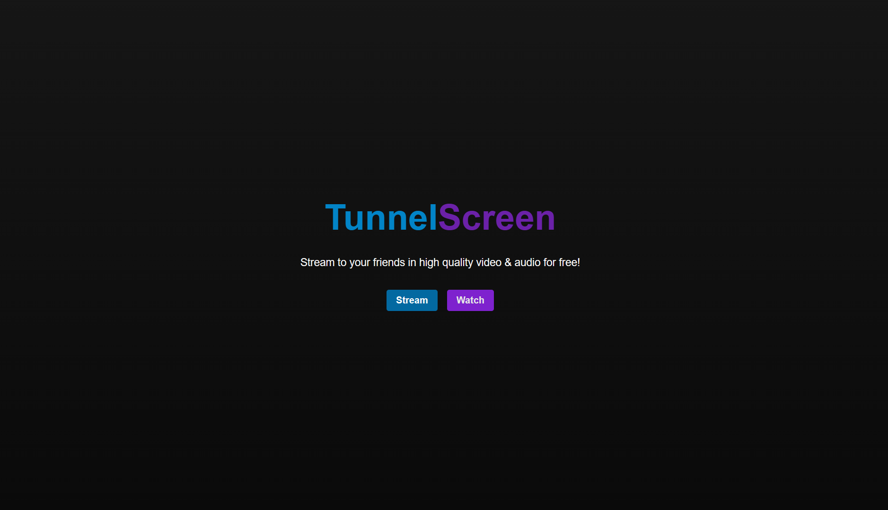

# TunnelScreen

<div align="center">
  <a href="#usage">Usage</a> •
  <a href="#technologies">Technologies</a> •
  <a href="#contributing">Contributing</a> •
  <a href="#running_backend">Running the Backend</a> •
  <a href="#running_frontend">Running the Frontend</a>
</div>

## :camera: Overview

<div align="center" >

  
</div>
<br>
<br>
TunnelScreen is an open-source app for personal video streaming in high quality for both audio and video! With TunnelScreen, you can easily set up an exposed stream with Ngrok and stream your video in 1080p 60fps for free.
<br>
<br>
Most of the streaming platforms out there limit you in quality or require a lot of setup time. With TunnelScreen, you can quickly make a room and share your screen with multiple users with the highest quality your internet allows, with no users limit.

<div id="usage">
  <h2>:hammer_and_wrench: Usage</h2>
</div>

### Expose your localhost with Ngrok
Unfortunately, most free hosting services available today do not allow us to run a SocketIO instance on the backend for real-time communication. Therefore, in order to enable real-time communication, we need to expose our localhost to the public. It is important to note that this approach is not meant for production purposes and should only be used for personal usage. I recommend using a service such as Ngrok to securely expose your localhost to the internet.

- Download Ngrok from the official website: https://ngrok.com/download

- Unzip the downloaded file to a location of your choice.

- Open a terminal or command prompt window and navigate to the directory where the Ngrok executable is located.

- Type the following command to expose your localhost on port 3000 (replace 3000 with the port number you want to use):

```bash
./ngrok http 3000
```

- Ngrok will generate a public URL that you can use to access your localhost from anywhere. Look for the line that says "Forwarding" and copy the URL that follows it.

- Paste the Ngrok URL into your browser and test that your app is working as expected. You might need to create a free account and save an authenticated key (you only need to do this one).

- Use the Ngrok URL to share your app with others.

### Hosting the stream
- Click on the "Stream" button on the homepage to be redirected to the ID generator.

- Copy the generated ID and share it with your friends.

- Create a room and start transmitting your screen.

### Joining a stream
- Click on the "Listener" button on the homepage.

- Paste the ID your friend sent you into the designated field.

- Watch the stream in high quality!

<br>

<div id="technologies">
  <h2>:rocket: Technologies</h2>
</div>

### Backend

✔️ Next (Socket.IO configured on Server-Side)

### Frontend

✔️ TypeScript | ✔️ ReactJS | ✔️ NextJS | ✔️ TailwindCSS | ✔️ Socket.IO | ✔️ Simple-Peer

<br>
<div id="running">
  <h2>⚙ Running</h2>
</div>

```bash

# Clone the repository
$ git clone https://github.com/leonardoacr/TunnelScreen.git

# Access the project folder

$ cd TunnelScreen

# Install packages

$ npm install

# Run the server on http://localhost:3000

$ npm run dev
```

<div id="to_do">
  <h2>📌 TO-DO List</h2>
</div>

- Update the Room on the server when someone disconnects (for now, when a user leaves the room the user list remains the same).

- Currently, if there is more than one listener, they must wait for the streamer to start streaming before connecting. If there is no media stream, the connection will not start.

- Improve audio quality. Attempted to force high-quality audio options, but it didn't make any difference.

- Build mode is not working. Spent a couple of hours trying to find out why but unfortunately, there is nothing that can be done at the moment. It only works in dev mode. If someone is up for fixing this, the error might be related to "peer.signal('answer|offer')". This is the error the streamer receives:

  - "Error connecting peer: Error: Connection failed. at c._onConnectionStateChange (495-d9424efb039c8594.js:6:63986) at _pc.onconnectionstatechange (495-d9424efb039c8594.js:6:53953)"
This is the error the listener receives:

  - "Error connecting peer: DOMException: Failed to execute 'setLocalDescription' on 'RTCPeerConnection': Failed to set local answer sdp: Called in wrong state: stable"

- Add a chat box on the live stream. I already made a separate code is available, but it's too raw to implement here. It might be a feature in the future!

- Check if it's possible to change the quality of the received stream, I tried a couple of things but nothing worked.

- Add the possibility os seeing the video stats (like buffering, quality, resolution and frame rate).

<div id="contributing">
  <h2>:raised_hands: Contributing</h2>
</div>

If you would like to contribute to this template, please feel free to submit a pull request or open an issue to improve this template. 
<br>
